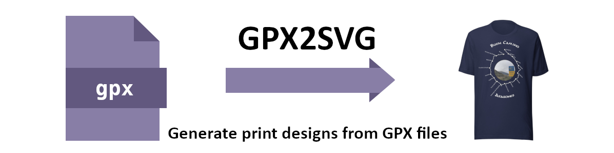
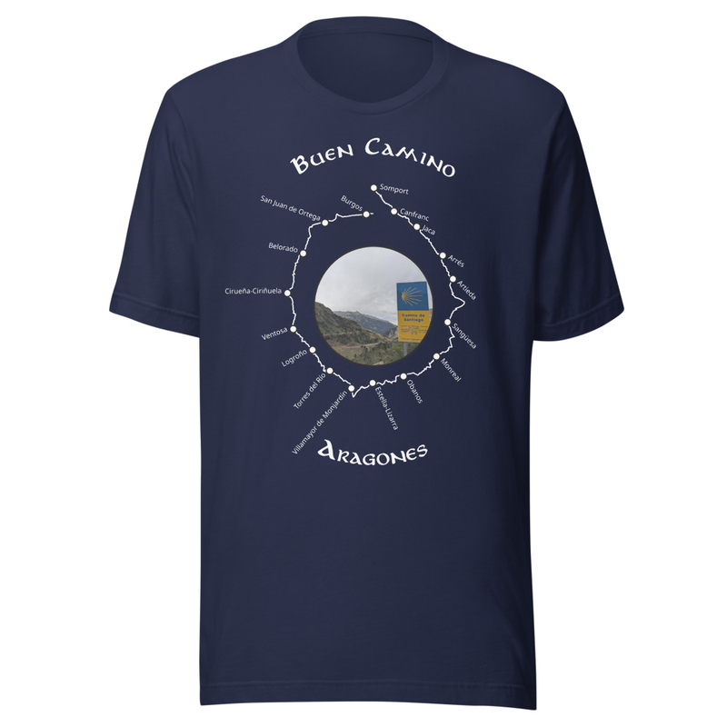

GPX2SVG
=======

Generate Print Design from gpx files

## Setup Instructions


### Prerequisites
- Python 3.8 or higher
- pip package manager

### Installation

1. Create and activate virtual environment:

```bash
python -m venv venv
source venv/bin/activate       # Linux/Mac
source venv\Scripts\activate   # Windows
```
2. Install required packages

```bash
pip install -r requirements.txt
```

## Usage Design with Elevation

1. Place your GPX files in the `tracks` directory. Note the GPX files must contain elevation data.
2. Configure parameters in `config.yaml` as needed.
3. Run the main script:

```bash
python make-design-elevation.py
```
This will calculate the elevation profile, store metadata and the design.
4. Generated SVG files will be saved in the `out` directory.

The execution will generate the following files:
- `out/design.svg`: SVG design for printing
- `out/design_elevation_profile.png`: Elevation profile image for reference and error checking
- `out/design_stops.csv`: List of stops based on track file: Config to show the label, name of the stop rotate and flip the text

5. Edit the `out/design_stops.csv` script with proper stop names
6. Re-run the script to update the `out/design.svg` with the new stop names. This can be repeated until all labels are proper

```bash
python make-design-elevation.py
```

6. Finalize design using [Incscape](https://inkscape.org)
7. For printing suggested export dpi: 600

## Get tracks with Google Maps elevation data

If you did not record your own track using a gps logger, smartphone or smartwatch you can follow these instructions:

1. Go to [Google Maps](https://maps.google.com)
2. Plan your desired route using the Directions function
3. Copy the route link

4. Use a GPX export tool like [mapstogpx.com](https://mapstogpx.com) or [gpx.studio](https://gpx.studio) to convert the Google Maps route to a GPX file.
5. Download the GPX file
6. Enhance the GPX file with elevation data using [gpsvisualizer.com](https://www.gpsvisualizer.com/elevation) to add elevation data to the GPX file.
7. Download the enhanced GPX file with elevation data and place it in the `tracks` directory.
8. Run the `make-design-elevation.py` script as described above to generate your design.

